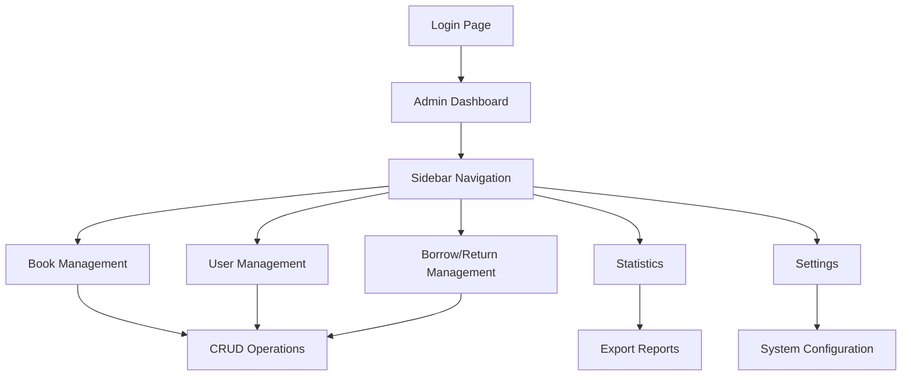

## 1. Tổng quan sản phẩm

Hệ thống quản trị (Admin Dashboard) là giao diện quản lý cho phép admin kiểm soát toàn bộ hoạt động của thư viện sách. Sản phẩm này giúp admin quản lý sách, người dùng, mượn/trả sách và theo dõi thống kê một cách hiệu quả.

Mục tiêu là xây dựng lại giao diện admin với thiết kế hiện đại, chi tiết và dễ mở rộng, cung cấp trải nghiệm người dùng tốt hơn cho người quản trị.

## 2. Tính năng cốt lõi

### 2.1 Vai trò người dùng

| Vai trò | Phương thức đăng ký | Quyền hạn cốt lõi |
|---------|---------------------|-------------------|
| Admin | Đăng nhập bằng tài khoản được cấp | Quản lý toàn bộ hệ thống: sách, người dùng, mượn/trả, thống kê |

### 2.2 Mô-đun tính năng

Hệ thống admin bao gồm các trang chính sau:

1. **Trang tổng quan**: Thống kê tổng quát, biểu đồ, tổng số sách/người dùng/mượn trả
2. **Trang quản lý sách**: Danh sách sách, thêm/sửa/xóa, tìm kiếm, lọc theo thể loại
3. **Trang quản lý người dùng**: Danh sách người dùng, phân quyền, trạng thái tài khoản
4. **Trang quản lý mượn/trả**: Theoo dõi phiếu mượn, trạng thái sách, quá hạn
5. **Trang thống kê**: Báo cáo chi tiết, biểu đồ xu hướng, xuất báo cáo
6. **Trang cài đặt**: Cấu hình hệ thống, quản lý thể loại, cài đặt thông báo

### 2.3 Chi tiết trang

| Tên trang | Mô-đun | Mô tả tính năng |
|-----------|---------|------------------|
| Trang tổng quan | Thống kê nhanh | Hiển thị số liệu tổng quát: tổng sách, người dùng, đang mượn, quá hạn |
| Trang tổng quan | Biểu đồ thống kê | Biểu đồ cột/trendline thể hiện xu hướng mượn sách theo tháng |
| Trang tổng quan | Hoạt động gần đây | Danh sách các hoạt động mới nhất: mượn/trả sách, đăng ký user |
| Quản lý sách | Danh sách sách | Bảng dữ liệu với phân trang, hiển thị: tiêu đề, tác giả, thể loại, trạng thái |
| Quản lý sách | Tìm kiếm & Lọc | Tìm theo tiêu đề/tác giả/ISBN, lọc theo thể loại/trạng thái |
| Quản lý sách | Form thêm/sửa | Modal form với các trường: tiêu đề, tác giả, mô tả, thể loại, ảnh bìa |
| Quản lý người dùng | Danh sách user | Bảng hiển thị: tên, email, vai trò, trạng thái, ngày đăng ký |
| Quản lý người dùng | Quản lý vai trò | Phân quyền admin/user, kích hoạt/vô hiệu hóa tài khoản |
| Quản lý mượn/trả | Danh sách phiếu | Bảng theo dõi: người mượn, sách, ngày mượn, hạn trả, trạng thái |
| Quản lý mượn/trả | Xử lý mượn/trả | Nút duyệt mượn, ghi nhận trả, tính phí quá hạn |
| Thống kê | Báo cáo tổng hợp | Tổng hợp số liệu theo khoảng thời gian, xuất PDF/Excel |
| Thống kê | Biểu đồ chi tiết | Pie chart thể loại sách, line chart xu hướng mượn |
| Cài đặt | Quản lý thể loại | CRUD danh mục thể loại sách |
| Cài đặt | Cấu hình hệ thống | Thiết lập thời gian mượn, phí quá hạn, email thông báo |

## 3. Luồng hoạt động cốt lõi

**Luồng Admin chính:**
1. Admin đăng nhập → Vào trang tổng quan xem thống kê
2. Từ sidebar navigation → Chọn chức năng cần quản lý
3. Thực hiện các thao tác CRUD trên các trang quản lý
4. Xem báo cáo thống kê và xuất file nếu cần
5. Cấu hình hệ thống trong trang cài đặt

## 4. Thiết kế giao diện

### 4.1 Phong cách thiết kế

**Màu sắc chính:**
- Primary: #2563eb (Blue 600) - Cho nút và liên kết chính
- Secondary: #64748b (Slate 500) - Cho text phụ
- Background: #f8fafc (Slate 50) - Nền chính
- Surface: #ffffff - Card backgrounds
- Success: #10b981 - Trạng thái thành công
- Warning: #f59e0b - Cảnh báo
- Error: #ef4444 - Lỗi

**Typography:**
- Font chính: Inter, system-ui, sans-serif
- Heading: 24px/32px (font-semibold) cho tiêu đề trang
- Body: 14px/20px cho nội dung chính
- Small: 12px/16px cho text phụ

**Component styling:**
- Buttons: Rounded-lg (8px), shadow-sm, hover transitions
- Cards: Rounded-xl (12px), shadow, border subtle
- Forms: Rounded-md (6px), focus:ring-2, focus:border-blue-500
- Tables: Rounded-lg, striped rows, hover:bg-gray-50

**Icon style:**
- Lucide React icons - consistent line weight (2px)
- Size: 16px cho inline, 20px cho buttons, 24px cho navigation

### 4.2 Tổng quan thiết kế trang

| Tên trang | Mô-đun | Yếu tố UI |
|-----------|---------|------------|
| Dashboard | Stats cards | Card layout 4 cột, icon to, gradient background, number animation |
| Dashboard | Charts | Recharts AreaChart với gradient fill, tooltip custom, legend |
| Dashboard | Activity feed | Timeline với avatar, timestamp, status badges |
| Book Management | Data table | Ag-Grid hoặc custom table với sorting, filtering, pagination |
| Book Management | Search bar | Input group với icon search, clear button, filter dropdown |
| Book Management | Action modals | Modal với backdrop blur, form steps, validation errors |
| User Management | User cards | Card grid với avatar, role badges, status indicator |
| User Management | Role selector | Dropdown với color-coded roles, permission matrix |
| Borrow/Return | Status badges | Colored badges: pending/approved/returned/overdue |
| Borrow/Return | Date picker | Calendar component với range selection, disabled dates |
| Statistics | Chart cards | Full-width cards với chart titles, download buttons |
| Settings | Config panels | Accordion sections với form inputs, save indicators |

### 4.3 Responsive Design

**Desktop-first approach:**
- Breakpoints: 640px, 768px, 1024px, 1280px
- Sidebar: Collapsible on mobile, always visible on desktop >1024px
- Tables: Horizontal scroll on mobile, full features on desktop
- Cards: Single column on mobile, grid layout on desktop
- Modals: Full-screen on mobile, centered overlay on desktop

**Touch optimization:**
- Minimum touch target: 44px
- Swipe gestures cho mobile navigation
- Pull-to-refresh cho data tables
- Zoom disabled cho form inputs

### 4.4 Interactive Elements

**Animations & Transitions:**
- Page transitions: Fade in/out (200ms)
- Modal: Scale + fade (300ms ease-out)
- Dropdown: Slide down + fade (150ms)
- Loading states: Skeleton screens, shimmer effect
- Success feedback: Toast notifications với progress bar

**Micro-interactions:**
- Button hover: Scale(1.02) + shadow-md
- Card hover: TranslateY(-2px) + shadow-lg
- Table row hover: Background color transition
- Chart interactions: Tooltip follow cursor, highlight on hover