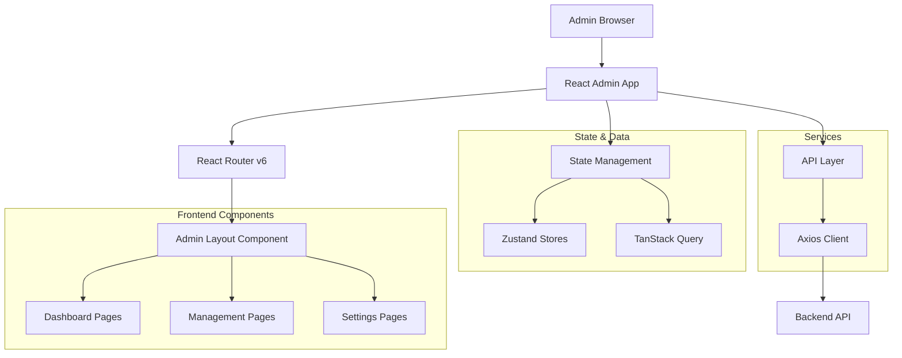

## 1. Thiết kế kiến trúc



## 2. Mô tả công nghệ

**Frontend Stack:**
- React@18 + TypeScript@5 - Component-based architecture với type safety
- Vite@5 - Build tool nhanh, HMR tốt, optimized cho development
- TailwindCSS@3 - Utility-first CSS framework cho responsive design
- React Router v6 - Client-side routing với nested routes
- Zustand@4 - Lightweight state management cho admin preferences
- TanStack Query@5 - Server state management, caching, background refetch
- Recharts@2 - Biểu đồ thống kê interactive
- Lucide React@latest - Consistent icon library

**Component Libraries:**
- HeadlessUI@latest - Accessible UI components (modal, dropdown, transition)
- React Hook Form@latest - Form handling với validation
- Zod@latest - Schema validation cho forms và API responses
- Date-fns@latest - Date manipulation và formatting

**Development Tools:**
- ESLint + Prettier - Code formatting và linting
- Husky + lint-staged - Git hooks cho code quality
- Vitest@latest - Unit testing framework
- React Testing Library - Component testing utilities

## 3. Định nghĩa routes

| Route | Mục đích | Layout | Components |
|-------|----------|---------|------------|
| /admin | Dashboard chính | AdminLayout | StatsGrid, ActivityFeed, Charts |
| /admin/books | Quản lý sách | AdminLayout | BookTable, SearchBar, BookModal |
| /admin/books/new | Thêm sách mới | AdminLayout | BookForm với steps |
| /admin/books/:id/edit | Sửa thông tin sách | AdminLayout | BookForm pre-filled |
| /admin/users | Quản lý người dùng | AdminLayout | UserTable, RoleManager |
| /admin/users/:id | Chi tiết user | AdminLayout | UserProfile, ActivityHistory |
| /admin/borrows | Quản lý mượn/trả | AdminLayout | BorrowTable, StatusFilter |
| /admin/statistics | Thống kê & báo cáo | AdminLayout | ChartContainer, ReportGenerator |
| /admin/settings | Cài đặt hệ thống | AdminLayout | SettingsPanel, ConfigForm |
| /admin/profile | Profile admin | AdminLayout | ProfileForm, PasswordChange |

**Nested Routes Structure:**
```
/admin
├── /dashboard (index)
├── /books
│   ├── / (index)
│   ├── /new
│   └── /:id/edit
├── /users
│   ├── / (index)
│   └── /:id
├── /borrows
├── /statistics
├── /settings
└── /profile
```

## 4. Kiến trúc component

**Atomic Design Pattern:**

```
src/features/admin/
├── components/
│   ├── atoms/           # Basic building blocks
│   │   ├── Button/
│   │   ├── Input/
│   │   ├── Badge/
│   │   └── Icon/
│   ├── molecules/       # Component groups
│   │   ├── SearchBar/
│   │   ├── Pagination/
│   │   ├── StatusBadge/
│   │   └── DataCard/
│   ├── organisms/       # Complex components
│   │   ├── DataTable/
│   │   ├── ChartCard/
│   │   ├── SidebarNav/
│   │   └── Modal/
│   └── templates/      # Page layouts
│       ├── AdminLayout/
│       └── FormLayout/
├── hooks/               # Custom hooks
│   ├── useDebounce.ts
│   ├── usePagination.ts
│   ├── useChartData.ts
│   └── useAuth.ts
├── stores/              # Zustand stores
│   ├── useAdminStore.ts
│   ├── useUIStore.ts
│   └── useAuthStore.ts
├── utils/               # Helper functions
│   ├── formatters.ts
│   ├── validators.ts
│   └── constants.ts
└── types/               # TypeScript types
    ├── admin.types.ts
    ├── book.types.ts
    └── user.types.ts
```

## 5. State Management Architecture

**Zustand Stores:**

```typescript
// useAdminStore - Admin preferences và UI state
interface AdminStore {
  sidebarCollapsed: boolean
  theme: 'light' | 'dark'
  notifications: Notification[]
  toggleSidebar: () => void
  addNotification: (notification: Notification) => void
  clearNotification: (id: string) => void
}

// useUIStore - Global UI state
interface UIStore {
  loading: boolean
  modal: ModalState | null
  drawer: DrawerState | null
  setLoading: (loading: boolean) => void
  openModal: (modal: ModalState) => void
  closeModal: () => void
}
```

**TanStack Query Structure:**
```typescript
// Query keys organization
const queryKeys = {
  books: ['books'] as const,
  book: (id: string) => ['books', id] as const,
  users: ['users'] as const,
  user: (id: string) => ['users', id] as const,
  borrows: ['borrows'] as const,
  statistics: ['statistics'] as const,
  categories: ['categories'] as const,
}

// Custom hooks cho queries
export const useBooks = (params: BookParams) => {
  return useQuery({
    queryKey: [...queryKeys.books, params],
    queryFn: () => bookAPI.getBooks(params),
    staleTime: 5 * 60 * 1000, // 5 minutes
    cacheTime: 10 * 60 * 1000, // 10 minutes
  })
}
```

## 6. Kiến trúc API Integration

**API Service Layer:**

```typescript
// Base API client với interceptors
class APIClient {
  private client: AxiosInstance
  
  constructor() {
    this.client = axios.create({
      baseURL: import.meta.env.VITE_API_URL,
      timeout: 10000,
      headers: {
        'Content-Type': 'application/json',
      }
    })
    
    // Request interceptor cho auth
    this.client.interceptors.request.use((config) => {
      const token = localStorage.getItem('token')
      if (token) {
        config.headers.Authorization = `Bearer ${token}`
      }
      return config
    })
    
    // Response interceptor cho error handling
    this.client.interceptors.response.use(
      (response) => response,
      (error) => {
        if (error.response?.status === 401) {
          // Handle unauthorized
          localStorage.clear()
          window.location.href = '/auth'
        }
        return Promise.reject(error)
      }
    )
  }
}

// Typed API services
export const bookAPI = {
  getBooks: (params: BookParams): Promise<PaginatedResponse<Book>> =>
    apiClient.get('/books', { params }),
    
  createBook: (data: CreateBookDTO): Promise<Book> =>
    apiClient.post('/books', data),
    
  updateBook: (id: string, data: UpdateBookDTO): Promise<Book> =>
    apiClient.put(`/books/${id}`, data),
    
  deleteBook: (id: string): Promise<void> =>
    apiClient.delete(`/books/${id}`),
}
```

## 7. Form Architecture & Validation

**React Hook Form + Zod Schema:**

```typescript
// Book form schema
const bookSchema = z.object({
  title: z.string().min(1, 'Title is required').max(200),
  author: z.string().min(1, 'Author is required').max(100),
  isbn: z.string().regex(/^\d{13}$/, 'ISBN must be 13 digits'),
  categories: z.array(z.string()).min(1, 'At least one category required'),
  description: z.string().max(1000).optional(),
  publishYear: z.number().int().min(1900).max(new Date().getFullYear()),
  quantity: z.number().int().min(0),
  coverImage: z.any().optional(),
})

type BookFormData = z.infer<typeof bookSchema>

// Form component với validation
export const BookForm: React.FC<BookFormProps> = ({ book, onSubmit }) => {
  const {
    register,
    handleSubmit,
    formState: { errors, isSubmitting },
    control,
    setValue,
  } = useForm<BookFormData>({
    resolver: zodResolver(bookSchema),
    defaultValues: book || defaultBookValues,
  })
  
  return (
    <form onSubmit={handleSubmit(onSubmit)} className="space-y-4">
      <Input
        {...register('title')}
        error={errors.title?.message}
        placeholder="Enter book title"
      />
      {/* Additional form fields */}
    </form>
  )
}
```

## 8. Performance Optimization

**Code Splitting Strategy:**

```typescript
// Lazy loading cho admin routes
const AdminDashboard = lazy(() => import('./pages/Dashboard'))
const BookManagement = lazy(() => import('./pages/BookManagement'))
const UserManagement = lazy(() => import('./pages/UserManagement'))

// Route-based code splitting
{
  path: '/admin',
  element: <AdminLayout />,
  children: [
    {
      index: true,
      element: (
        <Suspense fallback={<DashboardSkeleton />}>
          <AdminDashboard />
        </Suspense>
      )
    }
  ]
}
```

**Data Fetching Optimization:**

```typescript
// Implement pagination và debounced search
export const useBookSearch = (searchTerm: string) => {
  const debouncedSearchTerm = useDebounce(searchTerm, 300)
  
  return useQuery({
    queryKey: ['books', 'search', debouncedSearchTerm],
    queryFn: () => bookAPI.searchBooks(debouncedSearchTerm),
    enabled: debouncedSearchTerm.length > 2,
    staleTime: 60 * 1000, // 1 minute
  })
}

// Prefetching cho better UX
export const usePrefetchBook = (id: string) => {
  const queryClient = useQueryClient()
  
  return useCallback(() => {
    queryClient.prefetchQuery({
      queryKey: ['books', id],
      queryFn: () => bookAPI.getBook(id),
      staleTime: 5 * 60 * 1000,
    })
  }, [queryClient, id])
}
```

## 9. Error Handling & Loading States

**Error Boundary Implementation:**

```typescript
// Admin-specific error boundary
export const AdminErrorBoundary: React.FC<{ children: ReactNode }> = ({ children }) => {
  return (
    <ErrorBoundary
      FallbackComponent={({ error, resetErrorBoundary }) => (
        <div className="min-h-screen flex items-center justify-center bg-gray-50">
          <div className="text-center">
            <h2 className="text-2xl font-bold text-gray-900 mb-2">Something went wrong</h2>
            <p className="text-gray-600 mb-4">{error.message}</p>
            <Button onClick={resetErrorBoundary} variant="primary">
              Try again
            </Button>
          </div>
        </div>
      )}
      onError={(error) => {
        // Log to error reporting service
        console.error('Admin error:', error)
      }}
    >
      {children}
    </ErrorBoundary>
  )
}
```

**Loading States Hierarchy:**

```typescript
// Skeleton components cho different UI patterns
export const DashboardSkeleton = () => (
  <div className="animate-pulse">
    <div className="grid grid-cols-1 md:grid-cols-2 lg:grid-cols-4 gap-4 mb-8">
      {[...Array(4)].map((_, i) => (
        <div key={i} className="bg-white rounded-lg p-6 shadow-sm">
          <div className="h-4 bg-gray-200 rounded w-24 mb-2"></div>
          <div className="h-8 bg-gray-200 rounded w-16"></div>
        </div>
      ))}
    </div>
    <div className="bg-white rounded-lg p-6 shadow-sm">
      <div className="h-64 bg-gray-200 rounded"></div>
    </div>
  </div>
)
```

## 10. Testing Strategy

**Unit Testing:**

```typescript
// Component testing với Vitest
describe('BookForm', () => {
  it('renders all form fields', () => {
    render(<BookForm onSubmit={vi.fn()} />)
    
    expect(screen.getByLabelText(/title/i)).toBeInTheDocument()
    expect(screen.getByLabelText(/author/i)).toBeInTheDocument()
    expect(screen.getByLabelText(/isbn/i)).toBeInTheDocument()
  })
  
  it('validates required fields', async () => {
    const onSubmit = vi.fn()
    render(<BookForm onSubmit={onSubmit} />)
    
    fireEvent.click(screen.getByRole('button', { name: /save/i }))
    
    await waitFor(() => {
      expect(screen.getByText(/title is required/i)).toBeInTheDocument()
      expect(onSubmit).not.toHaveBeenCalled()
    })
  })
})
```

**Integration Testing:**

```typescript
// API integration tests
describe('BookAPI', () => {
  it('fetches books with pagination', async () => {
    const mockBooks = { data: [], total: 0, page: 1, limit: 10 }
    server.use(
      rest.get('/api/books', (req, res, ctx) => {
        return res(ctx.json(mockBooks))
      })
    )
    
    const result = await bookAPI.getBooks({ page: 1, limit: 10 })
    expect(result).toEqual(mockBooks)
  })
})
```